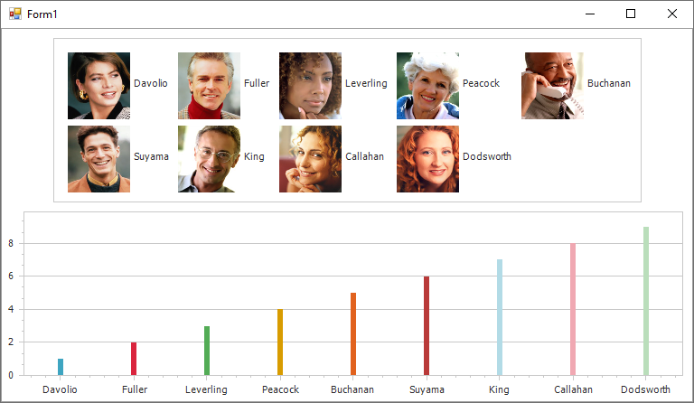

<!-- default badges list -->

<!-- default badges end -->

# Chart for WinForms - How to Add Images for Legend Items

This example demonstrates how to handle the [CustomDrawSeries](https://docs.devexpress.com/WindowsForms/DevExpress.XtraCharts.ChartControl.CustomDrawSeries?v=22.2&f=CustomDrawSeries) event to add images for items shown in the chart's legend.

## Files to Review

* [Form1.cs](./CS/Form1.cs) (VB: [Form1.vb](./VB/Form1.vb))

## Documentation

[Legend Items](https://docs.devexpress.com/WindowsForms/115949/controls-and-libraries/chart-control/legends/legend-items?v=22.2&p=netframework)

## More Examples

[Chart for WinForms - Draw a Custom Legend Marker for a Series](https://github.com/DevExpress-Examples/winforms-chart-draw-a-custom-legend-marker-for-a-series)

